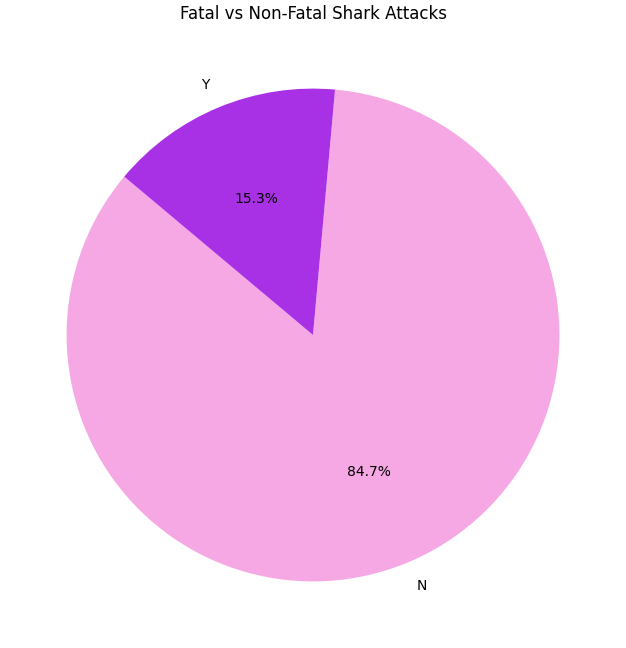

# Shark Attack Prediction

Classifies the likelihood of a shark attack based on age, sex, activity, species, and type.  Utilizes Sci-kit learn to construct and fine-tune the machine learning model.
Uses random forest classifier to classify shark attack data from kaggle.
Cleaned and preprocessed with Pandas and NumPy.  

  

## File Overview:
- **`clean_data.py`**: Cleans and structures raw shark attack data obtained from Kaggle.
- **`format.py`**: Handles display formatting for reports.
- **`dt_rf_pipeline.py`**: Constructs and evaluates classification models to predict fatal outcomes.
- **`newAttacks-model.joblib`**: A trained machine learning model ready for deployment.

## How to Run:

Install dependencies:
 - pip install pandas matplotlib seaborn scikit-learn joblib

Clean data:
- python clean_data.py

Train and evaluate the model:
- python dt_rf_pipeline.py